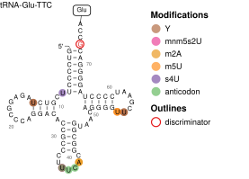

```{r}
#| include: false
knitr::opts_chunk$set(
  collapse = TRUE,
  comment = "#>",
  fig.path = "man/figures/README-",
  out.width = "100%"
)
```

# clover

<!-- badges: start -->
[](https://github.com/rnabioco/clover/actions/workflows/R-CMD-check.yaml)
<!-- badges: end -->

clover facilitates analysis and visualization of nanopore tRNA sequencing
data, including differential expression, base-calling error analysis, and
modification co-occurrence networks.

**clover is under active development.** *Caveat emptor*.

## Installation

You can install the development version of clover from
[GitHub](https://github.com/rnabioco/clover) with:

``` r
# install.packages("pak")
pak::pak("rnabioco/clover")
```

## Features

clover provides a complete toolkit for nanopore tRNA-seq analysis:

- **Differential tRNA abundance** --- Test for expression changes between conditions using DESeq2, with volcano plots and tabular summaries.
- **Charging analysis** --- Measure aminoacylation levels per tRNA and compare across conditions, including joint abundance-charging visualizations.
- **Base-calling error profiles** --- Visualize per-position error rates that reflect RNA modifications, with annotation overlays from [MODOMICS](https://genesilico.pl/modomics/).
- **Modification heatmaps** --- Map error rate differences to Sprinzl coordinates for cross-tRNA comparison of modification signatures.
- **tRNA secondary structure** --- Render cloverleaf diagrams annotated with modifications, co-occurrence linkages, and custom highlights (shown above).
- **Modification co-occurrence** --- Compute odds ratios for pairwise modification co-occurrence and visualize as chord diagrams, arc plots, or structure overlays.

clover is very opinionated about file inputs and assumes that data have been processed by the [aa-tRNA-seq-pipeline](https://github.com/rnabioco/aa-tRNA-seq-pipeline).

## Example

clover ships tRNA structure references for major expeirmental systems that enable
structure-based tRNA annotation.

```{r}
#| label: example
#| echo: false
#| warning: false
#| message: false
#| results: hide
library(clover)
library(dplyr)

trna_fasta <- clover_example("ecoli/trna_only.fa.gz")
mods <- modomics_mods(trna_fasta, organism = "Escherichia coli")

mods_glu <- mods |>
  filter(ref == "host-tRNA-Glu-TTC-1-1")

# Look up sequence positions for Sprinzl anticodon (34-36) and
# discriminator base (73)
sprinzl <- read_sprinzl_coords(
  clover_example("sprinzl/ecoliK12_global_coords.tsv.gz")
)
glu_coords <- sprinzl |>
  filter(trna_id == "tRNA-Glu-UUC-1-1")

ac_pos <- glu_coords |>
  filter(sprinzl_label %in% c("34", "35", "36")) |>
  pull(pos)

disc_pos <- glu_coords |>
  filter(sprinzl_label == "73") |>
  pull(pos)

anticodon <- tibble::tibble(
  pos = ac_pos,
  mod1 = rep("anticodon", 3)
)

all_mods <- bind_rows(mods_glu, anticodon)
disc_outline <- tibble::tibble(pos = disc_pos, group = "discriminator")
disc_text <- tibble::tibble(pos = disc_pos, color = "#E41A1C")

svg_path <- plot_tRNA_structure(
  "tRNA-Glu-TTC",
  "Escherichia coli",
  modifications = all_mods,
  mod_palette = c(default_mod_palette(), anticodon = "#4DAF4A"),
  outlines = disc_outline,
  outline_palette = c(discriminator = "#E41A1C"),
  text_colors = disc_text
)

dest <- "man/figures/README-structure-annotated.svg"
file.copy(svg_path, dest, overwrite = TRUE)
```

<p align="center">
  
</p>

See `vignette("clover")` for a complete walkthrough.

## Related work

- [aa-tRNA-seq-pipeline](https://github.com/rnabioco/aa-tRNA-seq-pipeline) is the Snakemake pipeline that generates the data clover analyzes.
- [R2easyR](https://github.com/JPSieg/R2easyR) visualizes structure probing signals on RNA secondary structure diagrams.
- [nanoblot](https://github.com/SamDeMario-lab/NanoBlot) facilitates visualization of nanopore sequencing data, including a "virtual gel" plot.
